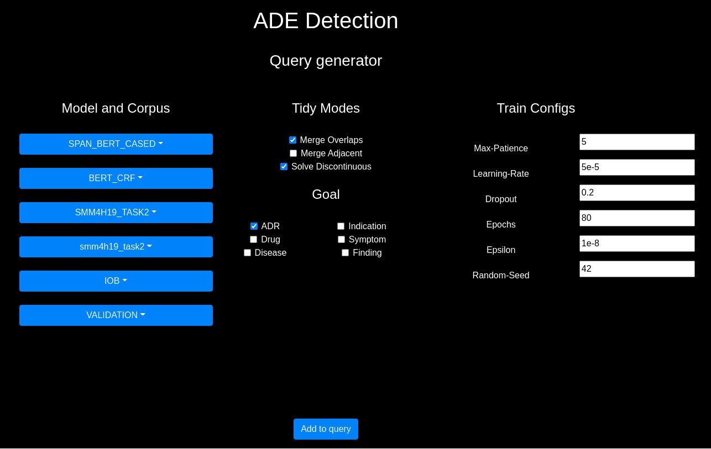

# ADE_Detection


## Datasets

* [CADEC-v2](https://data.csiro.au/collections/collection/CIcsiro:10948/SQcadec/RP1/RS25/RORELEVANCE/STsearch-by-keyword/RI1/RT1/)
* [SMM4H 2019](https://www.aclweb.org/anthology/W19-3203.pdf)

> You can freely extend this project adding a new datasets (you have to write a custom importer in `ade_detection/importers`)

## Our Models
    
* [SPAN_BERT_CASED](https://huggingface.co/SpanBERT/spanbert-base-cased)
* [BIO_BERT](https://huggingface.co/monologg/biobert_v1.1_pubmed)
* [BIO_BERT_GIT](https://github.com/vthost/biobert-pretrained-pytorch/releases/download/v1.1-pubmed/biobert_v1.1_pubmed.zip)
* [SCI_BERT](https://huggingface.co/allenai/scibert_scivocab_cased)
* [BIO_CLINICAL_BERT](https://huggingface.co/emilyalsentzer/Bio_ClinicalBERT)
* [BERT_TWEET](https://huggingface.co/vinai/bertweet-base)
* [PUB_MED_BERT](https://huggingface.co/microsoft/BiomedNLP-PubMedBERT-base-uncased-abstract-fulltext)
* [BERT_UNCASED](https://huggingface.co/bert-base-uncased)
* [TMRL](https://github.com/AnneDirkson/SharedTaskSMM4H2019)

> You can freely extend this project adding a model in `ade_detection/domain/enums.py`


## Requirements

* This code is tested with the "current" latest version of Python3 (3.8.6)
* If you are running on a Debian-based system, you need `python3.x-venv` and `python3.x-dev`

```sh
sudo apt-get install -y python3.x-venv python3.x-dev
```


## Get Started

(Optional) Setup a virtual environment

```sh
python3 -m pip install --user virtualenv
python3 -m venv env
source env/bin/activate
```

Install dependencies 

```sh
python3 -m pip install -r requirements.txt
python3 -m pip install -U spacy

# or similar depending on your local configs
python3 -m spacy download en_core_web_sm
```

## Check Installation

1. Check your [hugging face](https://huggingface.co/transformers/installation.html) (`transformers`) installation

```sh
python3 -c "from transformers import pipeline; print(pipeline('sentiment-analysis')('I hate you'))"
```

> models are cached in `TRANSFORMERS_CACHE` env variable (by default in `~/.cache/torch/transformers/` on Linux systems)


2. If you plan to use our porting of [TMRL Model - Dirkson & Verberne](https://www.aclweb.org/anthology/W19-3203.pdf) please run the following commands:

```sh
# it is necessary to down-grade regex package for flair v-0.4.1
python3 -m pip uninstall regex
python3 -m pip install regex==2018.01.10
python3 -m pip install flair==0.4.1
```

Then open a Python3 shell and type:

```py
import nltk
nltk.download('punkt')
```

Also download `obj_lex` from [here](https://github.com/AnneDirkson/LexNorm) and save it in `assets/models/dirkson/obj_lex`.

3. Check script (print the available CLI-commands)

```sh
python3 ade_detection.py -h


usage: ade_detection.py [-h] [-i] [-c] [--run N]

                              Welcome to ADE Detection Script :)  

+---------------------------------------------------------------------------------------------+
|   /  _  \ \______ \ \_   _____/ \______ \   _____/  |_  ____   _____/  |_|__| ____   ____   |
|  /  /_\  \ |    |  \ |    __)_   |    |  \_/ __ \   __\/ __ \_/ ___\   __\  |/  _ \ /    \  |
| /    |    \|    `   \|        \  |    `   \  ___/|  | \  ___/\  \___|  | |  (  <_> )   |  \ | 
| \____|__  /_______  /_______  / /_______  /\___  >__|  \___  >\___  >__| |__|\____/|___|  / |
|         \/        \/        \/          \/     \/          \/     \/                    \/  |
+---------------------------------------------------------------------------------------------+

optional arguments:
  -h, --help    show this help message and exit
  -i, --import  drop database and import all datasets
  -c, --clean   clean temporary/useless files
  --run N       run an array of tasks (remember to specify the name of your run .json)
```

4. Import datasets

> Tests require the presence of datasets in the right folder/with the right names; 
in case of datasets made by Tweets often the tweet text is not included and you have to download it using Twitter API 
(we suggest to use a ready to use library such as `tweepy` to get the job done in a while) 

* CADEC requires to save the dataset zip in `assets/datasets/cadec/CADEC.v2.zip`
* SMM4H-2019-Task2 resuires to save the dataset (whith the tweets texts) in `assets/datasets/smm4h19/SMM4H19.csv`

Here there is an example of the `SMM4H19.csv`:

```
,tweet_id,begin,end,type,extraction,drug,tweet,meddra_code,meddra_term
0,33...76,27,36,ADR,allergies,avelox,"do you have any medication allergies? ...",10013661.0,drug allergy
1,34...37,30,45,ADR,hurt your liver,avelox,"if #avelox has hurt your liver, avoid...",10024668.0,liver damage
2,35...88,46,48,ADR,ad,baclofen,"apparently, baclofen greatly exacerbates ...",10003731.0,attention deficit disorder
```

In order to import in the database the datasets run the following command:

```sh
python3 ade_detection.py --import
```

5. Run integration tests

```sh
python3 tests.py 
```


## Run a configuration

A configuration or run is a json file such as the example `assets/runs/run_example.json`

```json
[
    {
        "id": "1_CADEC_RUN_EXAMPLE_08.10.2020",
        "split_folder": "cadec",
        "corpus": "CADEC",
        "notation": "IOB",
        "model": "SPAN_BERT_CASED",
        "architecture": "BERT_CRF",
        "train_mode": "VALIDATION",
        "train_config": {
            "max_patience": "5",
            "learning_rate": "5e-5",
            "dropout": "0.15",
            "epochs": "80",
            "epsilon": "1e-8",
            "random_seed": "42"
        },
        "tidy_modes": [
            "MERGE_OVERLAPS",
            "SOLVE_DISCONTINUOUS"
        ],
        "goal": [
            "ADR"
        ]
    },
    {
        "id": "2_SMM4H_RUN_EXAMPLE_08.10.2020",
        "split_folder": "smm4h19_task2",
        "corpus": "SMM4H19_TASK2",
        "notation": "IOB",
        "model": "SPAN_BERT_CASED",
        "architecture": "BERT_WRAPPER",
        "train_mode": "VALIDATION",
        "train_config": {
            "max_patience": "5",
            "learning_rate": "5e-5",
            "dropout": "0.15",
            "epochs": "80",
            "epsilon": "1e-8",
            "random_seed": "42"
        },
        "tidy_modes": [
            "MERGE_OVERLAPS",
            "SOLVE_DISCONTINUOUS"
        ],
        "goal": [
            "ADR"
        ]
    }
]
```

You can run the example with:

```sh
python3 ade_detection.py --run run_example.json
```

You can easily build your custom `.json` configuration using `query_generator.html`, a simple UI for query building



After the generation save your query in `assets/runs/<name>.json`
and run your query with:

```sh
python3 ade_detection.py --run <name>.json
```

## Results

When your run ends you will find in the `tmp/` folder a `<task_id>.pickle` file for each task in your run; inside you will find the predictions the loss for each epoch of training/testing (depending on your task).

```py
import ade_detection.utils.file_manager as fm

results = fm.from_pickle("tmp/<task_id>.pickle")
print(results.val_df)
print(results.df)
```

If you want to use our comparator in order to get some metrics and the best 
configuration of iperparamenters feel free to use the `ade_detection/models/comparator.py` class.

```py
from ade_detection.models.comparator import Comparator

task1 = fm.from_pickle("tmp/<task_id>.pickle")
task2 = fm.from_pickle("tmp/<task_id>.pickle")

Comparator([task1, task2], "<result_name>.pickle")
```

After comparation a file `<result_name>.pickle` is generated, inside you will find the best configuration of iperparamenters wrt strict and partial F1-score.


Thanks,
ADE_Detection Team :)